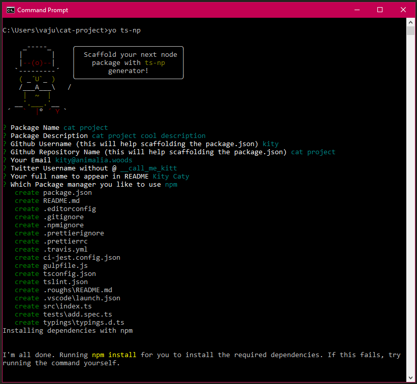

# generator-ts-np


Please note this package currently supports node.js version 8. Works for supporting higher versions are in progress. Sorry for the inconvenience.


[Yeoman](http://yeoman.io/) Generator For Building Node Packages :package: With [Typescript](https://www.typescriptlang.org).

[](https://www.npmjs.com/package/generator-ts-np)
[](https://travis-ci.org/vajahath/generator-ts-np)
[](https://www.npmjs.com/package/generator-ts-np)


## What

This package helps you to scaffold a directory skeleton required to start writing an npm package in Typescript, which is fully configured and ready to contain your module logic. And finally, ready to publish.

Here you write your logic in Typescript and publish the compiled version of it - easily.

## Why

- Inspired from [Typescript's own guide for node](https://github.com/Microsoft/TypeScript-Node-Starter#typescript-node-starter).
- Lint rules inspired from [Google APIs Node.js Client Repo](https://github.com/google/google-auth-library-nodejs) which means higher code quality.
- (Optional) Travis CI integration and Continuous Deployment to NPM when you push a tag.
- Compiles down your code to `es6`. (You can change this)
- No global dependencies.
- No own dependencies other than dev-dependencies.
- Pre-publish hook to lint and build - so that you never miss that stuff.
- Vscode integration.
- Integrated, fully configured [Jest](https://jestjs.io/) testing environment.
- Write tests in typescript itself.
- Scaffolds readme with all essential badges and stuffs.
- Familiar directory structure.
- Yarn/npm. Your choice.

[](https://www.typescriptlang.org/)

_You don't have to write any type definitions here. It will be packaged within your package automatically._

## Prerequisites

- [Yeoman](http://yeoman.io/) should be installed globally.
- **[Must]** Node version 8 must. (currently under development to support higher versions)

## Install

```bash
npm install -g generator-ts-np
```

## Usage

```
yo ts-np
```

### Have a peek (Linux/Windows/Mac)



## Handy commands

To know really what happens under the hood, refer `scripts` section in `package.json` at your package root.

| Script                       | What is it                                                                                                                                                    |
| ---------------------------- | ------------------------------------------------------------------------------------------------------------------------------------------------------------- |
| `npm test` or `npm run test` | Featured Command :star:. This is a right combination of all other commands. (`build`s and runs your tests in `tests/` directory)                              |
| `npm run build`              | compiles content of `src/` into `dist/` folder with some additional tasks like copying non-ts files cleaning dir, linting, prettifying etc.                   |
| `npm run lint`               | lints and styles your code with [prettier](https://www.npmjs.com/package/prettier) and [tslint](https://github.com/palantir/tslint) and fixes fixable issues. |
| `npm run lint-noFix`         | invokes `npm lint` without fix option => means if any issues found, it just notifies with out fixing it.                                                      |

## Travis CI/CD


CI/CD (Continuous Integration/ Continuous Deployment) helps you to automate the `npm publish` task.

This is disabled by default. Following are the things you would normally do while publishing your module(with out CI/CD).

- increment package version in your `package.json`
- run tests
- test your package against few stable versions
- build
- create a git tag for that version
- push tags
- npm publish

With CI/CD enabled, all you have to do is:

- increment package version in your `package.json`
- create git tag (`git tag v<version>`)
- push tags (`git push --tags`)

> :warning: However, for the first time you have to manually publish it using `npm publish`. Rest of the updates can be handled via travis.

Travis will do all other things for you, including publishing your package to npm.

### How To Enable Travis CI/CD

Open `.travis.ym` file in your scaffolded directory structure and follow instructions over there.

### How To Publish Your Package

After hand checking everything is correct,

- increment package version in your `package.json`
- `$ git tag vX.X.X` (example: `git tag v1.5.3`)
- `$ git push --tags`
- Head to travis page and see it is being deployed

## Directory structure


#### TL;DR

Here is what you get:

```mono
.
|   .editorconfig
|   .gitignore
|   .prettierignore
|   .prettierrc
|   .travis.yml
|   .yo-rc.json
|   ci-jest.config.json
|   gulpfile.js
|   package.json
|   README.md
|   tree.txt
|   tsconfig.json
|   tslint.json
|
+---.roughs
|       README.md
|
+---.vscode
|       launch.json
|
+---media
|       .gitkeep
|
+---src
|       index.ts
|
+---tests
|       add.spec.ts
|
\---typings
        typings.d.ts
```

- Additionally when you `npm run build` or `npm test`, a `dist` folder will also be created with all your compiled code. **`dist/src` is the directory which is going to be published to Npm.**
- `media/`: All your gallery.
- `src/`: All your source code.
- `typings/`: All your custom type definitions
- `tests/`: All your tests. Jest Test Runner looks at this directory.

#### Special Notes

- If you've any credentials/secrets, make a directory `credentials/` or `private/` at the root of your package, which will be ignored by both git and npm.
- When you `npm publish`, mainly the content of `dist/src/` will be published. To know what folders/files will be ignored, take a look at `files` section in package.json.
- The `media/` folder is `.npmignored` by default. So if you need to use some images inside your package, handle `files` section in package.json file accordingly. The idea here is that **you should not publish any unnecessary stuffs to npm registry**.

> :warning: **Important**: Before publishing your package, hand check each file and verify everything is perfect. `ts-np` only helps you to get started quickly and step back it self leaving the rest to you.

## Sponsor


## Issues?

If you found any issues, kindly report at [github issues](https://github.com/vajahath/generator-ts-np/issues).

## Licence

MIT &copy; [Vajahath Ahmed](https://twitter.com/vajahath7)
