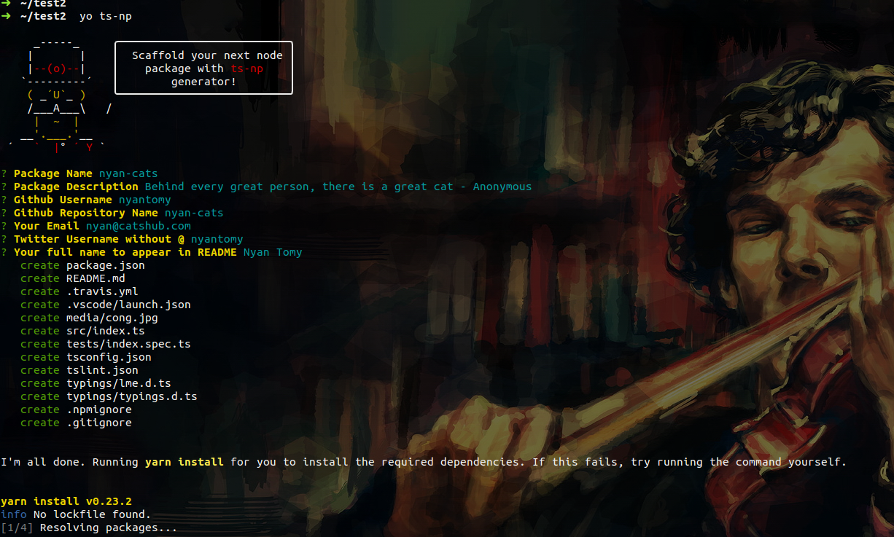

# generator-ts-np
Yeoman Generator For Building Node Packages With Typescript.

> :warning: This package is in Beta. You are warned!


## What?
This package helps you to scaffold a directory skeleton required to start writing an npm package in Typescript, which is fully configured and ready to contain your module logic. And finally, ready to publish.

Here you writes your logic in Typescript and publish the compiled version of it - easily.

## Why?
- Inspired from [Typescript's own guide for node](https://github.com/Microsoft/TypeScript-Node-Starter#typescript-node-starter).
- Lint rules adopted from [Google APIs Node.js Client Repo](https://github.com/google/google-auth-library-nodejs) which means higher code quality.
- Compiles down your code to `es5`. (which means the code runs in many versions of node)
- Pre-commit hooks for linters.
- Vscode integration.
- Integrated, fully configured mocha testing environment.
- Scaffolds readme with all essential badges and stuffs.
- Familiar directory structure.

## Prerequisites
- You need [Yarn](https://yarnpkg.com/en/) to use this generator, trust me it's awesome.
- **[Recommended]** Use this generator after initializing git.

## Install
```
npm install -g generator-ts-np
```

## Usage
```
yo ts-np
```
### Have a peek


## Directory structure
#### TL;DR
Here is what you get:
```
.
|-- media
|   `-- cong.jpg
|-- package.json
|-- README.md
|-- src
|   `-- index.ts
|-- tests
|   `-- index.spec.ts
|-- tsconfig.json
|-- tslint.json
|-- typings
|   |-- lme.d.ts
|   `-- typings.d.ts
|-- .gitignore
|-- .npmignore
|-- .travis.yml
|-- .vscode
`-- .yo-rc.json
```
- Additionally when you `npm build`, a `dist/` folder will also be created with all your compiled code.
- `media/`: All your gallery.
- `src/`: All your source code.
- `typings/`: All your type definitions
- `tests/`: All your tests. Mocha looks at this directory.

**Special Notes**
- If you've any credentials/secrets, make a directory `credentials/` at the root of your package, which will be ignored by both git and npm.
- When you `npm publish`, mainly the content of `dist/` will be published. To know what folders/files will be ignored, take a look at `.npmignore`.

> :warning: **Important**: Before publishing your package, hand check each and every file and verify everything is perfect. `ts-np` only helps you to get started quickly and step back it self leaving the rest to you.

## Handy commands
To know really what happens under the hood, refer `scripts` section in `package.json` at your package root.
- `npm run build`: compiles content of `src/` into `dist/` folder
- `npm run build-watch`: invokes `npm run build` under `watch` mode => means, it looks for file changes and if any, re-builds.
- `npm run lint`: lints and styles your code with [prettier](https://www.npmjs.com/package/prettier) and [tslint](https://github.com/palantir/tslint) and fixes fixable issues.
- `npm run lint-noFix`: invokes `npm lint` without fix option => means if any issues found, it just notifies with out fixing it.
- `npm test` or `npm run test`: runs your tests in `tests/` directory in TypeScript execution environment after temporarily setting env-var `NODE_ENV` to `test`.
- `npm run test-watch`: invokes `npm test` but in `watch` mode => means, if any file changes, it automatically re-run tests.

### Additional stuffs
- Your scaffolded package has a pre-commit hook on `npm run lint-noFix`. i.e., while you `git commit` your changes, it runs `npm run lint-noFix` to confirm that there are no issues with linting. If any issues found, it notifies and abort the commit.
- But don't worry, you can still force a commit by telling git to skip the pre-commit hooks by simply committing using `--no-verify`.


## Issues?
If you found any issues, kindly report at [github issues](https://github.com/vajahath/generator-ts-np/issues).

## Licence
MIT &copy; [Vajahath Ahmed](https://twitter.com/vajahath7)